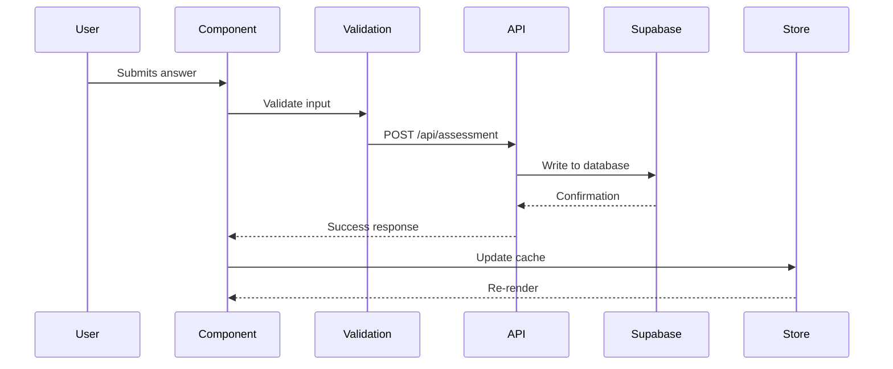
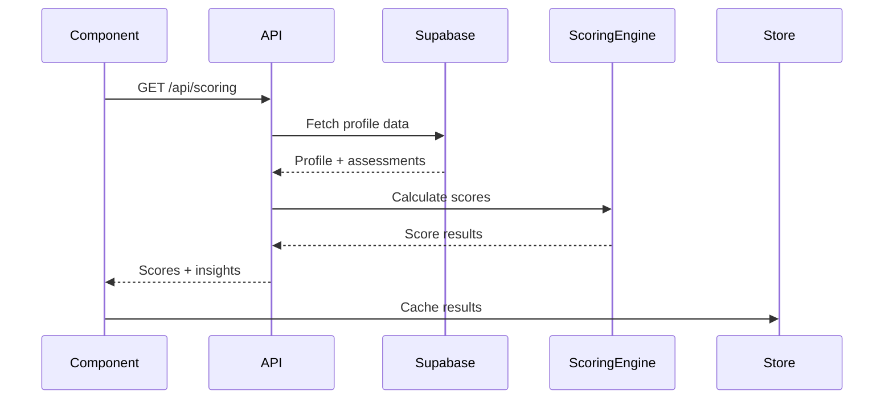

# IvyQuest Master Specification

> **Version**: 2.4.0
> **Last Updated**: 2026-01-17
> **Status**: AUTHORITATIVE

---

## Table of Contents

1. [System Overview](#1-system-overview)
2. [Architecture Principles](#2-architecture-principles)
3. [Data Flow](#3-data-flow)
4. [State Management](#4-state-management)
5. [Routing System](#5-routing-system)
6. [Component Architecture](#6-component-architecture)
7. [Scoring Engine](#7-scoring-engine)
8. [API Layer](#8-api-layer)
9. [Data Persistence](#9-data-persistence)
10. [Type System](#10-type-system)
11. [Constants & Configuration](#11-constants--configuration)
12. [Error Handling](#12-error-handling)
13. [Testing Strategy](#13-testing-strategy)
14. [Known Issues](#14-known-issues)
15. [Multi-Agent System](#15-multi-agent-system)
16. [Change Log](#16-change-log)

---

## 1. System Overview

### 1.1 Purpose

IvyQuest is an AI-powered college admissions assessment platform that guides students through a comprehensive evaluation of their profile, providing personalized insights and recommendations.

### 1.2 Core User Journey

```
Landing (/) → Quest Selection (/quest) → Assessment Frames (1-6) → Results (/results)
```

### 1.3 Technology Stack

| Layer | Technology | Version |
|-------|------------|---------|
| Framework | Next.js | 14.2.x |
| Language | TypeScript | 5.x |
| State | Zustand | 4.x |
| Database | Supabase | Latest |
| Styling | Tailwind CSS | 3.x |
| Animation | Framer Motion | 10.x |
| PDF | @react-pdf/renderer | 3.x |
| Validation | Zod | 3.x |

---

## 2. Architecture Principles

### 2.1 Single Source of Truth

| Data Type | Authoritative Source | Cache Location |
|-----------|---------------------|----------------|
| User Profile | Supabase `profiles` | `useProfileStore` |
| Assessment Answers | Supabase `assessments` | `useAssessmentStore` |
| Calculated Scores | Server-side API | `useResultsStore` |
| UI State | Component State | React useState |
| Navigation | URL | Next.js Router |

### 2.2 Data Flow Direction

```
Supabase (Truth) → API Layer → Zustand (Cache) → Components (Display)
                                    ↑
                    User Input → Validation → API → Supabase
```

### 2.3 Validation Strategy

All data validated at system boundaries using Zod schemas:

- **Inbound**: API request bodies, URL params, localStorage reads
- **Outbound**: Database writes, API responses

---

## 3. Data Flow

### 3.1 Assessment Flow



### 3.2 Scoring Flow



---

## 4. State Management

### 4.1 Store Architecture

```typescript
// Pure cache store - NO business logic
interface ProfileStore {
  // Cached data from Supabase
  profile: Profile | null;

  // Cache management
  setProfile: (profile: Profile) => void;
  clearCache: () => void;

  // Sync status
  lastSynced: Date | null;
  isSyncing: boolean;
}
```

### 4.2 Store Files

| Store | Path | Purpose |
|-------|------|---------|
| Profile | `lib/store/useProfileStore.ts` | User profile cache |
| Assessment | `lib/store/useAssessmentStore.ts` | Assessment answers cache |
| Results | `lib/store/useResultsStore.ts` | Calculated scores cache |
| Navigation | `lib/store/useNavigationStore.ts` | Frame navigation state |

### 4.3 Persistence

- Zustand persist middleware with localStorage
- Hydration handling for SSR compatibility
- Cache invalidation on data changes

---

## 5. Routing System

### 5.1 Route Structure

```
/                     # Landing page
/quest                # Quest selection
/quest/[frameId]      # Assessment frames (1-6)
/results              # Final results display
/results/pdf          # PDF generation
```

### 5.2 Frame Mapping

| Frame ID | Component | Purpose |
|----------|-----------|---------|
| 1 | Frame1Warmup | Introduction/warmup questions |
| 2 | Frame2Snapshot | Quick profile snapshot |
| 3 | Frame3Building | Detailed profile building |
| 4 | Frame4Reflection | Self-reflection questions |
| 5 | Frame5Reveal | Score reveal with rings |
| 6 | Frame6ProfileReveal | Full profile reveal |

### 5.3 Navigation Rules

- Sequential navigation enforced (cannot skip frames)
- Progress saved after each frame completion
- Direct URL access validates completion status

---

## 6. Component Architecture

### 6.1 Component Hierarchy

```
app/
├── layout.tsx              # Root layout
├── page.tsx                # Landing page
├── quest/
│   ├── page.tsx           # Quest selection
│   └── [frameId]/
│       └── page.tsx       # Dynamic frame router
└── results/
    └── page.tsx           # Results display

components/
├── frames/                 # Frame components
│   ├── Frame1Warmup.tsx
│   ├── Frame2Snapshot.tsx
│   ├── Frame3Building.tsx
│   ├── Frame4Reflection.tsx
│   ├── Frame5Reveal.tsx
│   └── Frame6ProfileReveal.tsx
├── insights/              # Insight display components
├── layout/                # Layout components
└── ui/                    # Shared UI components
```

### 6.2 Frame Component Contract

```typescript
interface FrameComponentProps {
  onComplete: () => void;
  onBack?: () => void;
}

// All frame components must:
// 1. Accept these props
// 2. Call onComplete when frame is finished
// 3. Handle loading states
// 4. Display errors gracefully
```

### 6.3 Brand Styling

**DO NOT USE dark-mode Tailwind classes in Frame components.**

```typescript
import { BRAND_COLORS } from '@/lib/constants/brand';

// Use inline styles with brand constants
style={{ color: BRAND_COLORS.textHeading }}     // #641432
style={{ color: BRAND_COLORS.textPrimary }}     // #374151
style={{ backgroundColor: BRAND_COLORS.bgPrimary }}
```

---

## 7. Scoring Engine

### 7.1 Location

**AUTHORITATIVE**: `/lib/scoring/` (server-side only)

### 7.2 Score Categories

| Category | Weight | Range |
|----------|--------|-------|
| Academic | 25% | 0-100 |
| Extracurricular | 20% | 0-100 |
| Leadership | 15% | 0-100 |
| Community | 15% | 0-100 |
| Personal | 15% | 0-100 |
| Application | 10% | 0-100 |

### 7.3 Calculation Rules

```typescript
// All calculations happen server-side
// NO scoring logic in client components

// Score normalization
const normalizeScore = (raw: number, min: number, max: number): number => {
  return Math.max(0, Math.min(100, ((raw - min) / (max - min)) * 100));
};

// Null handling with defaults
const SCORE_DEFAULTS = {
  baseline: 50,
  minimum: 0,
  maximum: 100,
};
```

### 7.4 Profile Tiers

| Tier | Criteria |
|------|----------|
| fresh-start | < 30% profile complete |
| emerging | 30-70% profile complete |
| optimization | > 70% profile complete |

---

## 8. API Layer

### 8.1 Endpoints

| Endpoint | Method | Purpose |
|----------|--------|---------|
| `/api/profile` | GET/PUT | Profile CRUD |
| `/api/assessment` | POST | Save assessment answer |
| `/api/scoring` | GET | Calculate and return scores |
| `/api/results` | GET | Fetch complete results |

### 8.2 Request/Response Contract

```typescript
// All API responses follow this structure
interface APIResponse<T> {
  success: boolean;
  data?: T;
  error?: {
    code: string;
    message: string;
  };
}
```

### 8.3 Validation

```typescript
// Every API route validates input
import { z } from 'zod';

const ProfileUpdateSchema = z.object({
  identity: z.object({...}).optional(),
  aptitude: z.object({...}).optional(),
  // ... other fields
});

export async function PUT(request: Request) {
  const body = await request.json();
  const validated = ProfileUpdateSchema.parse(body);
  // Process validated data
}
```

---

## 9. Data Persistence

### 9.1 Supabase Schema

```sql
-- profiles table
CREATE TABLE profiles (
  id UUID PRIMARY KEY DEFAULT gen_random_uuid(),
  user_id UUID REFERENCES auth.users,
  identity JSONB,
  aptitude JSONB,
  achievements JSONB,
  activities JSONB,
  goals JSONB,
  classification JSONB,
  created_at TIMESTAMPTZ DEFAULT NOW(),
  updated_at TIMESTAMPTZ DEFAULT NOW()
);

-- assessments table
CREATE TABLE assessments (
  id UUID PRIMARY KEY DEFAULT gen_random_uuid(),
  profile_id UUID REFERENCES profiles,
  frame_id INTEGER NOT NULL,
  answers JSONB NOT NULL,
  completed_at TIMESTAMPTZ DEFAULT NOW()
);

-- results table
CREATE TABLE results (
  id UUID PRIMARY KEY DEFAULT gen_random_uuid(),
  profile_id UUID REFERENCES profiles,
  scores JSONB NOT NULL,
  insights JSONB,
  calculated_at TIMESTAMPTZ DEFAULT NOW()
);
```

### 9.2 Row Level Security

```sql
-- Users can only access their own data
ALTER TABLE profiles ENABLE ROW LEVEL SECURITY;

CREATE POLICY "Users can view own profile"
  ON profiles FOR SELECT
  USING (auth.uid() = user_id);
```

### 9.3 Data Unification v5.2

**Problem Solved**: Brand statement mismatch between Dashboard AssessmentTab and Assessment Agent Card.

**Solution**: Single source of truth for identity data from database.

| Data Type | Source | Storage |
|-----------|--------|---------|
| **Scoring Data** (ivy_score, results) | API calculation | localStorage (`useResultsStore`) |
| **Identity Data** (brand_statement, spike, pillars) | Database | `profiles` table |

**Key Components**:

```typescript
// Hook: useProfileIdentity.ts
const { data: identity } = useProfileIdentity(profileId);
const brandStatement = identity?.brandStatement;

// Priority for profileId
const profileId = user?.id || store.profile_id || store.user_id;
```

**Database Functions** (migration 033):

| Function | Purpose |
|----------|---------|
| `get_profile_identity(p_profile_id)` | Fetch identity data with null-safe defaults |
| `update_profile_identity(...)` | Update identity columns, preserves existing values |

**Profile Identity Fields**:
- `narrative_brand_statement` - Synthesized brand statement
- `narrative_dna` - Narrative DNA
- `spike` - Student's unique spike
- `pillars` - Four pillars (IDENTITY, APTITUDE, PASSION, SERVICE)
- `identity_synthesis` - Complete EC Agent synthesis output

---

## 10. Type System

### 10.1 Core Types

```typescript
// /lib/types/profile.ts
interface Profile {
  id?: string;
  identity?: IdentityData;
  aptitude?: AptitudeData;
  achievements?: AchievementData;
  activities?: ActivityData;
  goals?: GoalsData;
  classification?: ClassificationData;
}

// /lib/types/scores.ts
interface ScoreResults {
  overall: number;
  categories: {
    academic: CategoryScore;
    extracurricular: CategoryScore;
    leadership: CategoryScore;
    community: CategoryScore;
    personal: CategoryScore;
    application: CategoryScore;
  };
  tier: ProfileTier;
  insights: Insight[];
}
```

### 10.2 Zod Schemas

```typescript
// /lib/validation/schemas.ts
export const ProfileSchema = z.object({
  id: z.string().uuid().optional(),
  identity: IdentitySchema.optional(),
  // ... other fields
});

export type Profile = z.infer<typeof ProfileSchema>;
```

---

## 11. Constants & Configuration

### 11.1 File Locations

| Constants | Path |
|-----------|------|
| Brand Colors | `/lib/constants/brand.ts` |
| Score Defaults | `/lib/constants/scoring.ts` |
| Frame Config | `/lib/constants/frames.ts` |
| API Config | `/lib/constants/api.ts` |

### 11.2 Brand Constants

```typescript
export const BRAND_COLORS = {
  primary: '#FF4A23',        // Ivylevel orange
  secondary: '#641432',      // Ivylevel maroon
  textHeading: '#641432',
  textPrimary: '#374151',
  textMuted: '#9ca3af',
  bgPrimary: 'rgba(255,255,255,0.95)',
  // ... full list in brand.ts
};
```

---

## 12. Error Handling

### 12.1 Error Boundaries

```typescript
// Each frame wrapped in error boundary
<ErrorBoundary fallback={<FrameErrorFallback />}>
  <Frame1Warmup onComplete={handleComplete} />
</ErrorBoundary>
```

### 12.2 API Error Handling

```typescript
// Consistent error responses
try {
  // API logic
} catch (error) {
  if (error instanceof z.ZodError) {
    return Response.json({
      success: false,
      error: { code: 'VALIDATION_ERROR', message: error.message }
    }, { status: 400 });
  }
  // Handle other errors
}
```

---

## 13. Testing Strategy

### 13.1 Test Scenarios

| Scenario | Description |
|----------|-------------|
| Fresh Start | Empty profile through all frames |
| Full Profile | Complete data through all frames |
| Partial Profile | Mixed completeness |
| Error States | API failures, validation errors |
| Edge Cases | Null values, missing data |

### 13.2 Test Commands

```bash
npm run type-check    # TypeScript validation
npm run lint          # ESLint
npm run test          # Unit tests
npm run test:e2e      # E2E tests (if configured)
```

---

## 14. Known Issues

### 14.1 Critical (Blocking)

| Issue | Description | Status |
|-------|-------------|--------|
| KI-001 | Dynamic import crash in Frame5GamePlan | OPEN |
| KI-002 | Inflated scores (100%+) on empty profile | OPEN |
| KI-003 | Missing CircularProgress rings in reveal | OPEN |

### 14.2 Issue Details

See `/docs/REFACTOR_AUDIT.md` for detailed analysis and remediation plans.

---

## 15. Multi-Agent System

### 15.1 Overview

IvyQuest uses a multi-agent architecture powered by the ReAct (Reasoning + Acting) framework. Each agent operates in cycles of THINK → ACT → OBSERVE → LEARN until quality thresholds are met.

### 15.2 Agent Types

| Agent | Purpose | Version |
|-------|---------|---------|
| EC Agent | Identity synthesis, spike generation, archetype classification | v5.1 |
| Awards Agent | Award matching with reach/target/safety portfolio balancing | v5.1 |
| Programs Agent | Program recommendations aligned with constraints | v5.1 |
| GamePlan Agent | Strategic roadmap orchestration across all agents | v5.1 |

### 15.3 ReAct Framework (v5.1)

#### Cycle Structure

```
1. THINK (LLM): Analyze profile → select tools → identify gaps → plan actions
2. ACT: Execute agent with structured feedback and hints
3. OBSERVE: Validate quality scores (guardrails, voice, golden, only_they)
4. LEARN (LLM): Analyze results → generate corrections → decide continue/stop
5. REPEAT until quality threshold (70) met or max cycles (3) reached
```

#### Quality Scoring Formula

```
combined_score = (
    guardrails_score * 0.25 +
    voice_score * 0.20 +
    golden_score * 0.25 +
    only_they_score * 0.30
)
```

### 15.4 ReAct Visualization (v5.1)

The dashboard provides real-time visibility into agent reasoning via expandable phase accordions.

#### Phase Display Components

| Phase | Icon | Color | Content |
|-------|------|-------|---------|
| THINK | 🧠 Brain | Orange (#FF4A23) | Reasoning, tools selected, focus areas, gap analysis |
| ACT | ⚡ Lightning | Blue (#3B82F6) | Tools executed, hints applied, input/output summaries |
| OBSERVE | 👁️ Eye | Purple (#8B5CF6) | Quality scores, pass/fail, issues/strengths found |
| LEARN | 📚 Book | Green (#10B981) | What worked/failed, quality delta, corrections |

#### Data Structures (v5.1)

```typescript
// Tool Selection (THINK phase)
interface ToolSelection {
  tool_id: string;
  tool_name: string;
  purpose: string;
  priority: number;
  estimated_duration_ms: number;
}

// Tool Execution (ACT phase)
interface ToolExecution {
  tool_id: string;
  tool_name: string;
  status: 'planned' | 'executing' | 'completed' | 'failed' | 'skipped';
  duration_ms: number;
  success: boolean;
  purpose?: string;
  input_summary?: Record<string, unknown>;
  output_summary?: Record<string, unknown>;
}

// Verbose Cycle Summary
interface CycleSummary {
  cycle: number;
  think: ThinkPhaseData;
  act: ActPhaseData;
  observe: ObservePhaseData;
  learn: LearnPhaseData;
  combined_score: number;
  quality_delta: number;
  passed: boolean;
  duration_ms: number;
}
```

### 15.5 Cycle Persistence (v5.1)

ReAct cycles are persisted to database for analytics and debugging.

#### Database Schema

```sql
-- react_cycles: Individual cycle data
CREATE TABLE react_cycles (
    id UUID PRIMARY KEY,
    profile_id UUID REFERENCES profiles(id),
    session_id TEXT NOT NULL,
    agent_id TEXT NOT NULL,
    cycle_number INT NOT NULL,
    think_data JSONB,
    act_data JSONB,
    observe_data JSONB,
    learn_data JSONB,
    combined_score FLOAT,
    passed BOOLEAN,
    duration_ms INT,
    created_at TIMESTAMPTZ
);

-- react_sessions: Aggregated session data
CREATE TABLE react_sessions (
    id UUID PRIMARY KEY,
    session_id TEXT UNIQUE NOT NULL,
    profile_id UUID REFERENCES profiles(id),
    agents_executed TEXT[],
    final_score FLOAT,
    total_cycles INT,
    success BOOLEAN,
    started_at TIMESTAMPTZ,
    completed_at TIMESTAMPTZ
);
```

#### Analytics Functions

- `get_session_cycles(session_id)`: Returns all cycles for a session
- `get_agent_trajectory(session_id, agent_id)`: Returns improvement trajectory
- `get_agent_success_rate(agent_id, days)`: Returns success rate statistics

### 15.6 File Locations

| File | Purpose |
|------|---------|
| `agents/core/react_wrapper.py` | ReAct cycle orchestration |
| `agents/core/react_types.py` | Python type definitions |
| `agents/core/cycle_persistence.py` | Database persistence helper |
| `lib/types/react-visualization.ts` | TypeScript type definitions |
| `components/agents/react/` | React visualization components |
| `supabase/migrations/032_*.sql` | Database migration |

---

## 16. Change Log

### [2026-01-17] - v2.4.0 - Data Unification v5.2

- **Added**: `useProfileIdentity` hook for database-sourced identity data
- **Added**: Database functions `get_profile_identity`, `update_profile_identity`
- **Fixed**: Brand statement mismatch between Dashboard and Agent Cards
- **Changed**: Identity data now persisted to database instead of localStorage
- **Changed**: Dashboard uses auth user ID as primary profileId source
- **Preserved**: Scoring data (ivy_score, results) still uses localStorage for Frames 4/5/6 compatibility

### [2025-12-18] - v2.1.0 - Initial Specification

- **Created**: Master specification document
- **Documented**: Current architecture and known issues
- **Established**: Single source of truth principles
- **Defined**: Refactoring protocol

---

## Appendix A: File Index

```
lib/
├── constants/
│   ├── brand.ts           # Brand colors and styling
│   ├── scoring.ts         # Score defaults and weights
│   └── frames.ts          # Frame configuration
├── hooks/
│   ├── usePersistence.ts  # Data persistence hook
│   └── useProfile.ts      # Profile management hook
├── scoring/
│   └── engine.ts          # Server-side scoring engine
├── store/
│   ├── useProfileStore.ts
│   ├── useAssessmentStore.ts
│   └── useResultsStore.ts
├── types/
│   ├── profile.ts
│   └── scores.ts
├── utils/
│   └── skipLogic.ts       # Profile tier calculation
└── validation/
    └── schemas.ts         # Zod validation schemas
```

---

*This is the authoritative specification. All implementations must conform to this document. Updates require spec change records.*
